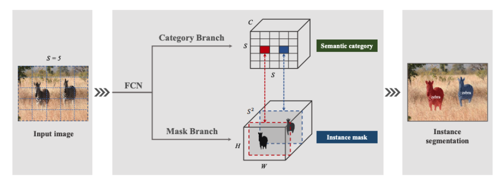
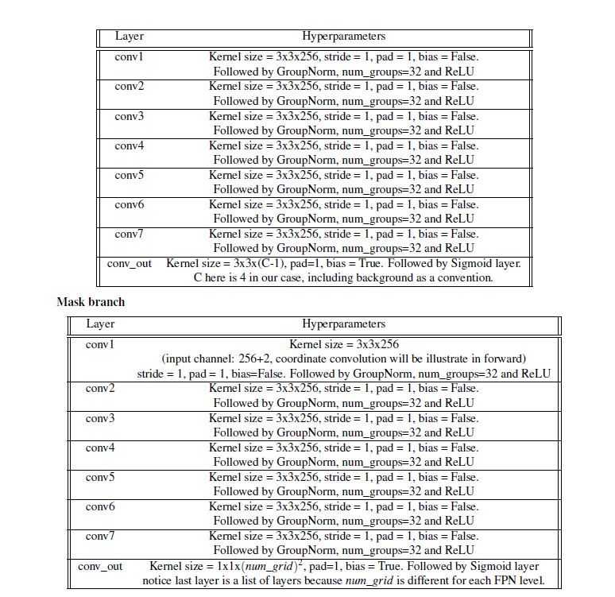
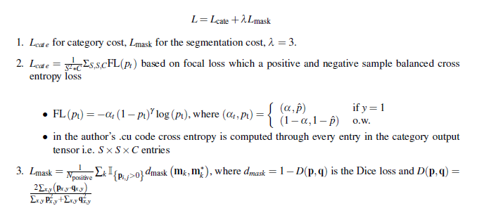
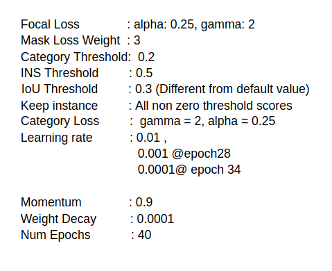
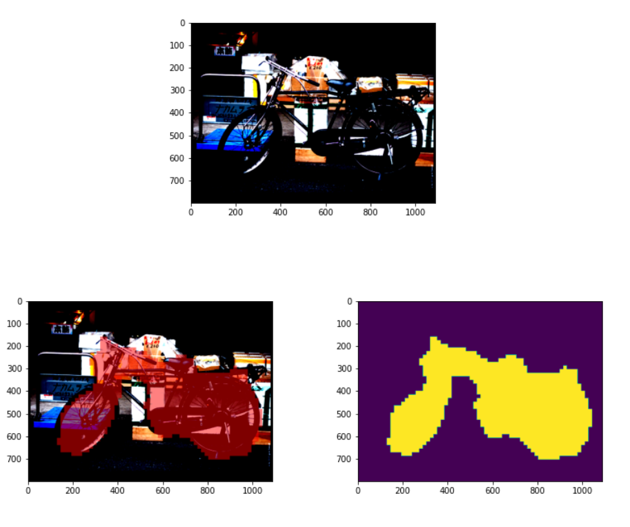
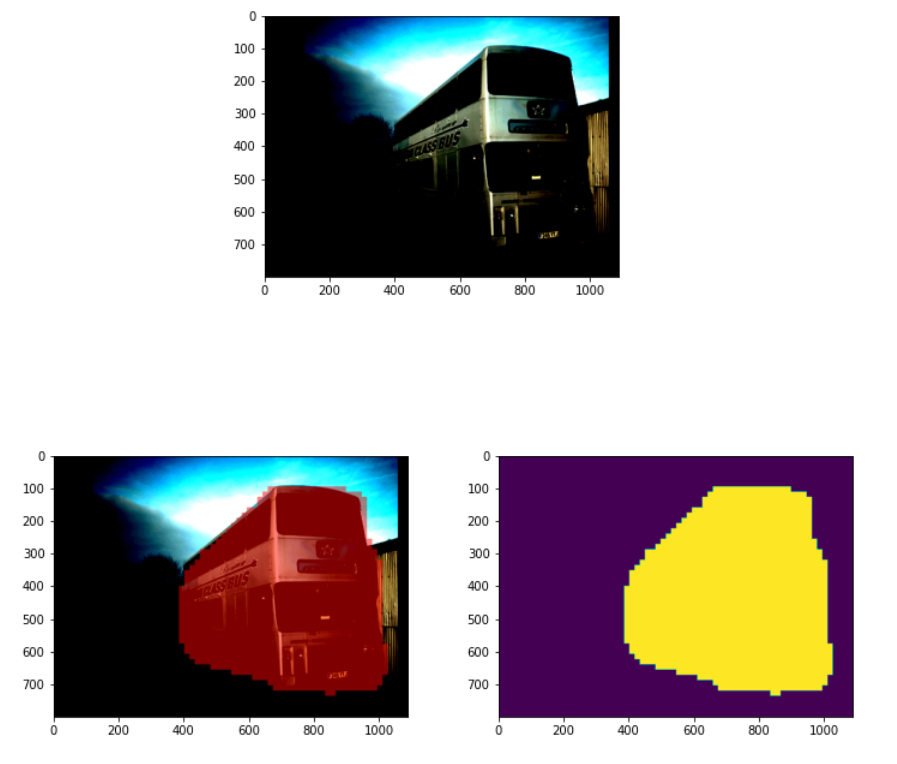
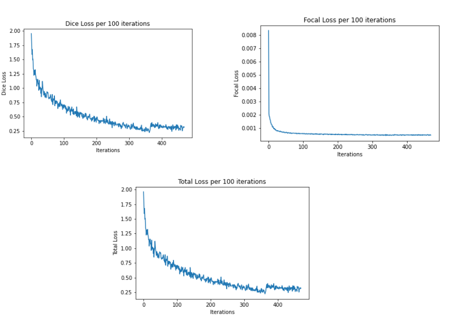
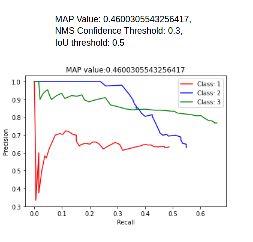

# SOLO

Original SOLO Paper
![https://arxiv.org/pdf/1912.04488.pdf]

In this project I implemented a newly proposed instance segmentation framework, namely Segmenting
Objects by Locations (SOLO). SOLO is a grid based framework but proposed to handle instance segmentation task. Different with traditional instance segmentation framework, SOLO does
not propose the bounding box location, instead, it proposes instance category and instance segmentation mask directly.

### Network Architecture

### Loss Objective

### Network Settings

### Results

### Loss Plots

### MAP

